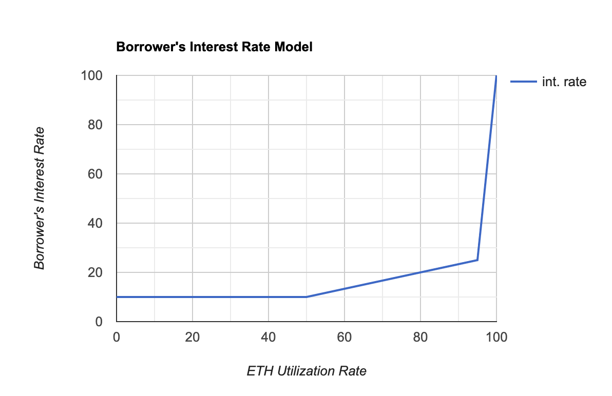
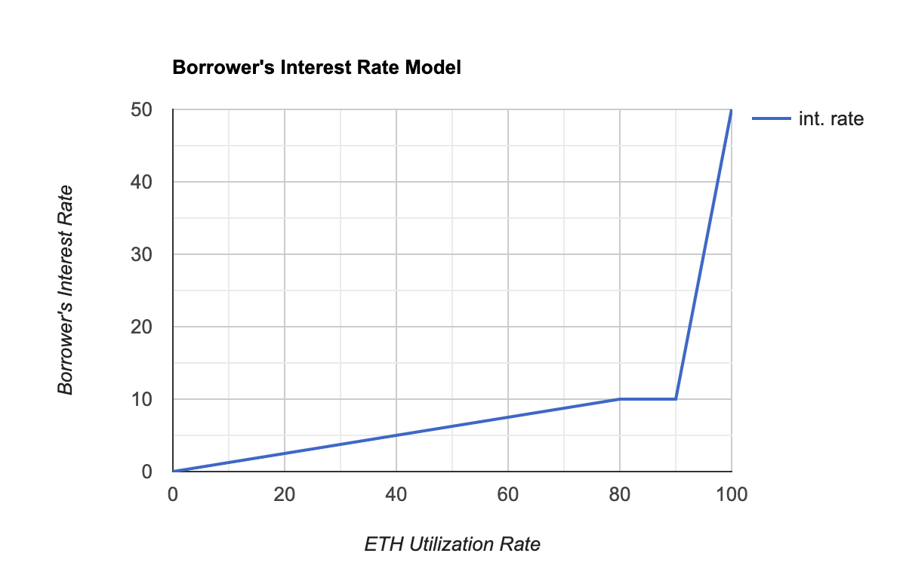

Alpha Homora Interest Rate Model Update Proposal

> **Voting:**
>
> Quorum: 10,000,000 ALPHA
>
> Voting starts: Oct 31 4:00AM UTC
> 
> Voting ends: Nov 7 4:00AM UTC
>
> Alpha Finance snapshot (Ethereum): https://snapshot.page/#/alpha-ethereum/proposal/QmZniBXQNgTxcbHTyeEx89S3KmyDtSnbGw8cHcK31LmZZx
> (snapshot block number 11197624)
>
> Alpha Finance snapshot (BSC): https://snapshot.page/#/alpha-bsc/proposal/QmfU746uFrEtHePnpcA52yUCPq1GckhSFwFnoh4AzhtbTV
> (snapshot block number 1968415)

## Simple Summary
This proposal aims to provide a more efficient utilization of ETH in Alpha Homora with the new interest rate model. The new model targets optimal utilization rate at 80-90%, which provides sufficient room for ETH withdrawal while efficiently utilizing most of the supplied ETH, increasing interest earned on ETH for lenders.

## Current Interest Rate Model

The current interest rate model follows a triple-slope interest rate curve:
- At 0-50% utilization rate, interest rate will be fixed at 10%
- At 50-95% utilization rate, interest rate goes up linearly to 25%
- At 95-100% utilization rate, interest rate goes up linearly to 100%

## Motivation
ETH is under-utilized. Due to lower yield farming APY, the current interest rate model only achieves 50-60% utilization rate, where borrowers’ interest rate is ~10% and lenders’ interest rate is 5-6%. 

## Specification

### New Interest Rate Model
I propose a new interest rate model to allow the supplied ETH to be efficiently utilized. The new model will also follow a triple-slope interest rate curve:
- At 0-80% utilization rate, interest rate goes from 0% up linearly to 10%
- At 80-90% utilization rate, interest rate will be fixed at 10%
- At 90-100% utilization rate, interest rate goes up linearly to 50%

## Rationale 
### Why this model?
- Starting from 0% interest rate → This allows the borrowers (or yield farmers with leveraged position) and lenders to decide what’s their optimal interest rate. The interest rate can be as low as 0%.
- The model’s target utilization rate is 80-90%, where the borrowers pay no extra interest rate (fixed at 10%). This optimal rate provides enough room for lenders to withdraw their supplied ETH while efficiently utilizing the supplied ETH.
- The interest rate spikes up towards the end to discourage too high of a utilization rate (to prevent a situation where ETH lenders cannot withdraw ETH due to over-utilization).

### How does this affect the current model?
With the current utilization rate (~50%), the borrowers will pay a slightly lower interest rate and lenders will receive a slightly lower interest rate. However, this should provide incentives for borrowers to borrow more ETH, driving up the utilization rate, which would in turns increase the interest rate for lenders.

## Test Cases

## Implementation

## Copyright
Copyright and related rights waived via [CC0](https://creativecommons.org/publicdomain/zero/1.0/).